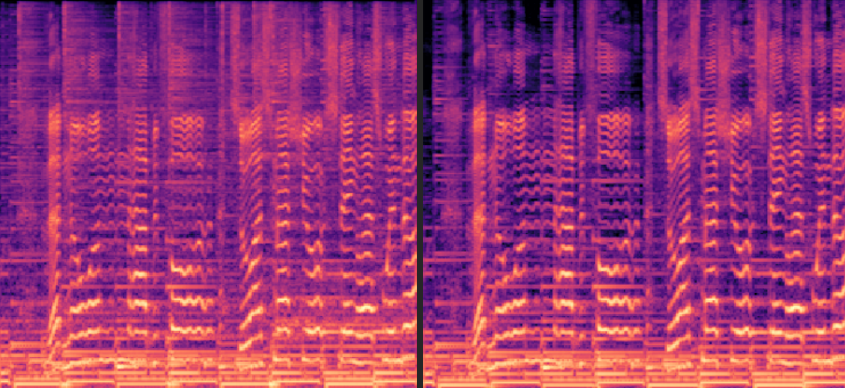
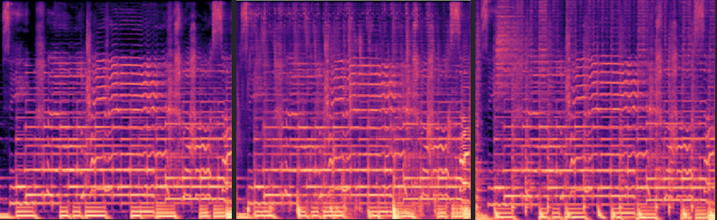

# Pix2Pix-Music-Accompaniment-Generation

This project is done as a Computer Science Bachelor's thesis the University of Tartu.

The goal was to generate music accompaniment using spectrograms and an image translation model Pix2Pix. The model was trained on the [MUSDB18 dataset](https://sigsep.github.io/datasets/musdb.html).

Demo of results can be found [here](https://pvastrik.github.io/Pix2Pix-Music-Accompaniment-Generation-Demo/) (in Estonian).

## Abstract
Generation of good quality music accompaniment is very useful for composers and music pro-ducers. Generative artificial neural networks are booming and there is recently an increasing amount of music generation models published. The aim of this Bachelor’s thesis is to generate music accompaniment using spectrograms and an image translation model Pix2Pix. Experiments are conducted to generate different types of accompaniments. The best results are achieved when generating the drum stem. It can be seen from the results that generative adversarial networks’ outputs contain unnatural artifacts that affect the results badly. Preventing this requires lots of finetuning.

## Data processing

The MUSDB18 dataset was used for training the model. The dataset contains 150 full-length music tracks with the corresponding isolated drums, bass, vocals, and other stems.

The dataset was preprocessed by overlaying some stems and then converting the audio files to spectrograms of size 256x256 pixels. This means about 5-6 seconds of music.

Spectrograms were saved as npz-files to keep the precision of the pixel values. Input and target spectrograms were concatenated to the same npz-file and split when loading the data before training.

For example, when generating the drum stem, the target spectrogram was the original music and the input spectrogram was the same without drums.

Example of a spectrogram pair for generating the drum stem:

## Training

Model was trained on LUMI supercomputers on one AMD MI250x GPU. Training for 100 epochs took about 70 hours. Training was done for generating only the drum stem and also for generating the whole accompaniment for vocals.

## Results

Results were good only for generating the drum stem. For both experiments, the model ouput contained the input sound but there were also some artifacts. The artifacts were more visible when generating the whole accompaniment for vocals.

For the drums, on epoch 95 the model output was without artifacts. Here is an example of input, output and target spectrograms for drum generation:

